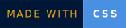
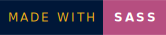
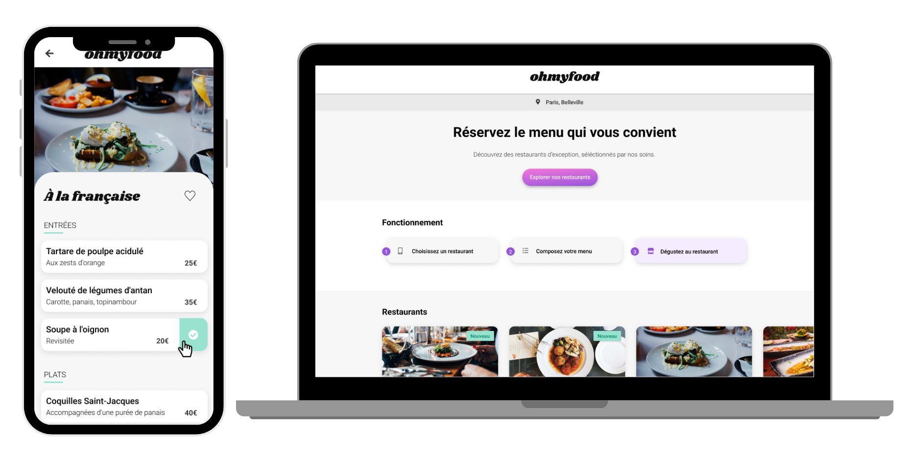

     


# Ohmyfood  


Ohmyfood is a website that lists menus from gourmet restaurants. 
It's site is coded in HTML, CSS, and Sass.

## Screenshots



## Installation

To install and run this project locally on your machine, follow these simple steps:

1. Make sure you have Node.js installed on your machine. If not, you can download and install it from [the official Node.js website](https://nodejs.org/).

2. Clone this GitHub repository to your local machine using the following command:

    ```
    git clone https://github.com/Merzakb/P4_Ohmyfood_benaissi_merzak
    ```

3. Install the necessary dependencies :

```bash
# Install dependencies
npm install
```

```bash
#  compile the SCSS files into the style.css file
npm run sass
``` 

## Technologies :

   

## Authors

- [@Merzak](https://github.com/Merzakb)


## 🔗 Links
[](https://merzak-portfolio.vercel.app/)
[](https://www.linkedin.com/in/merzak-b-0300b9289/)
[](https://twitter.com/__merzak)
